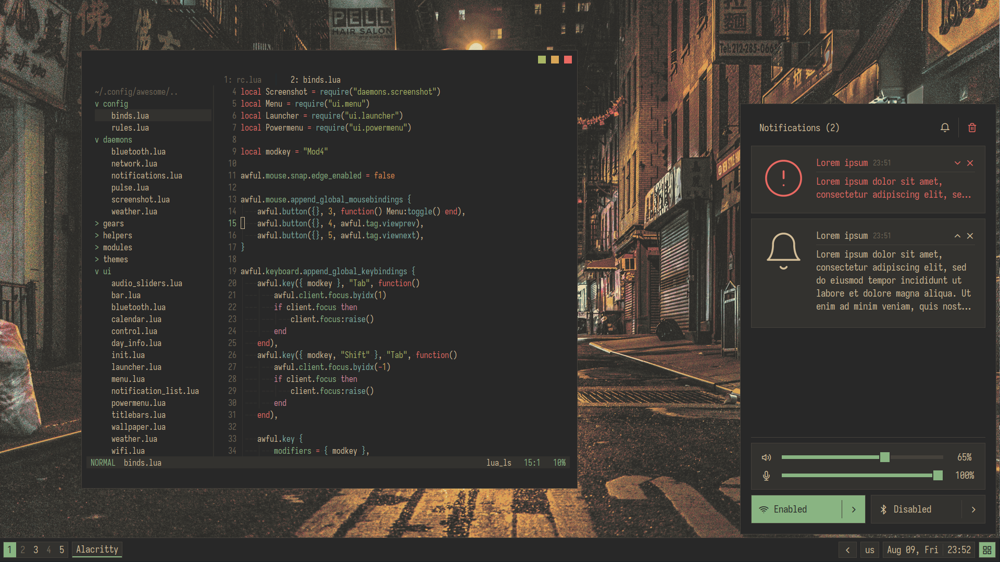
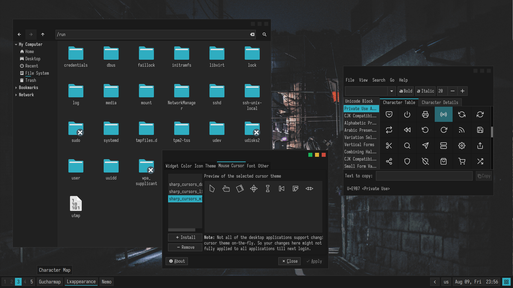
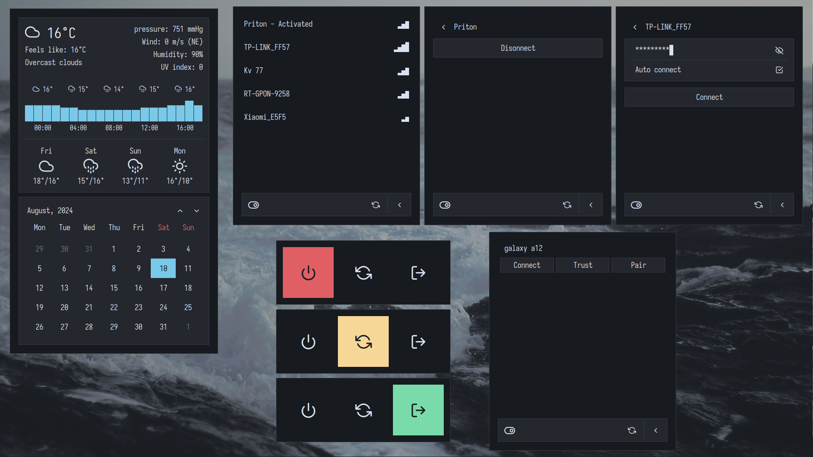

<p align="center">
    
</p>

<details>
<summary><b>more previews</b></summary>

<p align="center">
    
    
    
</p>

</details>

## Instalation

- Install dependencies
```
$ sudo pacman -S xorg xorg-xinit pulseaudio networkmanager bluez bluez-utils \
rsync alacritty picom maim imagemagick lxappearance polkit-gnome
```

- Install `awesome-git` package from aur (pikaur for example)
```
$ pikaur -S awesome-git
```

- Start & enable `network manager` & `bluez` services
```
$ systemctl start NetworkManager.service
$ systemctl enable NetworkManager.service
$ systemctl start bluetooth
$ systemctl enable bluetooth
```

- Setup home dir (before running `rsync` its better to make backup of your home directory, otherwise some files will be replaced)
```
$ git clone --depth 1 https://github.com/myagko/dotfiles.git
$ rsync -avhu ~/dotfiles/home/ ~/
```

- Also dont forget to edit `.xinitrc`, maybe you have different monitor(s) so you need different xrandr options
```
xrandr --output DisplayPort-0 --mode 1920x1080 --rate 165.00 &
```

- Keyboard layouts, edit `/etc/X11/xorg.conf.d/00-keyboard.conf`
```
Section "InputClass"
    Identifier "system-keyboard"
    MatchIsKeyboard "on"
    Option "XkbLayout" "us,ru"
    Option "XkbModel" "pc105"
    Option "XkbOptions" "grp:alt_shift_toggle"
EndSection
```

- Edit `~/.config/awesome/user.lua` as you need, you can set theme, choose default apps, and set data for weather widget

<details>
<summary><b>Keybindings</b></summary>

| Keybinding            | Description                              |
| --------------------- | ---------------------------------------- |
| `Mod+Shift+r`         | Restart awesomewm                        |
| `Mod+Tab`             | switch client                            |
| `Mod+b`               | move client to center                    |
| `Mod+v`               | toggle client fullscreen                 |
| `Mod+z`               | close client                             |
| `Mod+x`               | minimize client                          |
| `Mod+c`               | (un)maximize client                      |
| `Mod+1...9`           | only view tag                            |
| `Mod+Shift+1...9`     | move focused client to tag               |
| `Mod+d`               | open app launcher                        |
| `Mod+q`               | open powermenu                           |
| `Mod+w`               | open terminal                            |
| `Print`               | take screenshot                          |
| `Shift+Print`         | take screenshot area                     |

- Tiling keybinds (now disabled)

| Keybinding            | Description                              |
| --------------------- | ---------------------------------------- |
| `Mod+Shift+s`         | swap with next client by index           |
| `Mod+Ctrl+s`          | swap with previous client by index       |
| `Mod+Shift+a`         | increase the number of master clients    |
| `Mod+Ctrl+a`          | decrease the number of master clients    |
| `Mod+Shift+q`         | increase the number of columns           |
| `Mod+Ctrl+q`          | decrease the number of columns           |
| `Mod+Shift+e`         | increase master width factor             |
| `Mod+Ctrl+e`          | decrease master width factor             |
| `Mod+Ctrl+Shift+e`    | reset master width factor                |
| `Mod+Space`           | switch layout                            |

</details>

<details>
<summary><b>Additional customization</b></summary>

- Icons and themes
1. Install `themix-full-git` from aur
2. Export icons and theme from user presets

- Cursors (`inkscape` required) ([source](https://github.com/charakterziffer/cursor-toolbox))
```
$ cd ~/dotfiles/extra/cursor_toolbox
$ ~/dotfiles/extra/cursor_toolbox/render-pngs.py ~/dotfiles/extra/cursor_toolbox/sharp_dark.svg
$ ~/dotfiles/extra/cursor_toolbox/make_dark.sh
$ cp -r sharp_cursors_dark ~/.icons
```

- Firefox css
1. Search `about:config`.
2. `toolkit.legacyUserProfileCustomizations.stylesheets`, `layers.acceleration.force-enabled`, `gfx.webrender.all`, `svg.context-properties.content.enabled` change to `True`.
3. Copy `~/dotfiles/extra/mozilla/chrome` to `~/.mozilla/firefox/XXXXXXX.default-release/`.

- Firefox startpage
1. Edit `/usr/lib/firefox/autoconfig.cfg`
```
var {classes:Cc,interfaces:Ci,utils:Cu} = Components;
try {
  Cu.import("resource:///modules/AboutNewTab.jsm");
  var newTabURL = "file:///home/username/yourfile.html";
  AboutNewTab.newTabURL = newTabURL;
} catch(e){Cu.reportError(e);}
```
2. Edit `/usr/lib/firefox/defaults/pref/autoconfig.js`
```
pref("general.config.filename", "autoconfig.cfg");
pref("general.config.obscure_value", 0);
pref("general.config.sandbox_enabled", false);
```
3. Set homepage at firefox settings

- Apply cursor, icons and gtk themes with `lxappearance`

</details>
