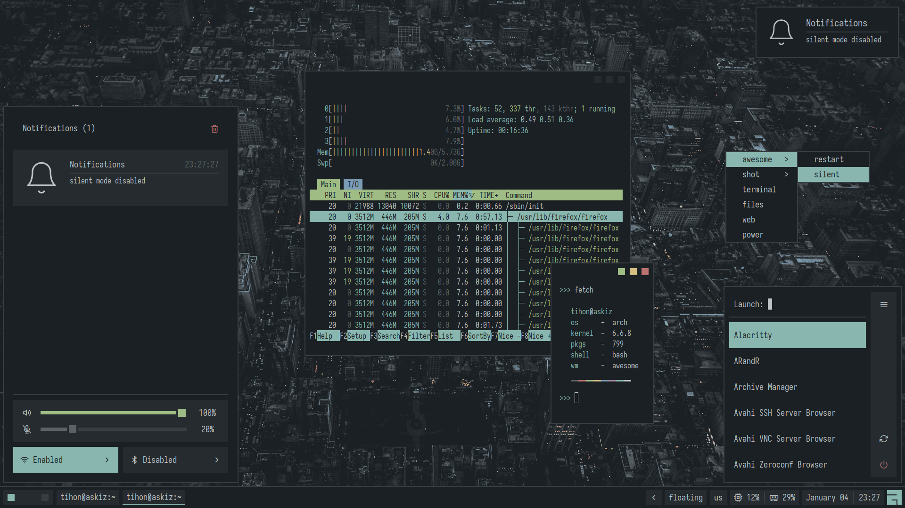

<div align="center">
     
</div>

## Guide

<details>
<summary><b>Installation</b></summary>
<h1></h1>

- Install dependencies
```
$ sudo pacman -S xorg-server xorg-xinit xorg-xrandr xorg-xcursorgen \
pulseaudio networkmanager bluez bluez-utils rsync \
alacritty picom maim imagemagick lxappearance firefox ttf-iosevka-nerd
```

- Install `awesome-git` package from aur (pikaur for example)
```
$ pikaur -S awesome-git
```

- Start & enable `network manager` & `bluez` services

- Setup home dir
```
$ git clone --depth 1 https://github.com/myagko/dotfiles.git
$ rsync -avhu ~/dotfiles/home/ ~/
```

<h1></h1>
</details>

<details>
<summary><b>Post-install setup</b></summary>
<h1></h1>

- Change preffered apps, autostart, openweathermap user data and other at
`~/.config/awesome/user.lua`

- Setup firefox css
1. In the searchbar type `about:config`. A dialog will be shown to you. Press the `I accept the risk` button.
2. Search for `toolkit.legacyUserProfileCustomizations.stylesheets`, `layers.acceleration.force-enabled`, `gfx.webrender.all`, and `svg.context-properties.content.enabled`. Change them to `True`
3. Go to your Firefox profile: `~/.mozilla/firefox/XXXXXXX.default-release/`
4. Copy the `~/dotfiles/extra/mozilla/chrome` folder into the directory.

- Setup firefox startpage  \
guide: <a href="https://peterries.net/blog/firefox-ubuntu-local-file/">here</a>  \
folder: `~/dotfiles/extra/mozilla/startpage`

<h1></h1>
</details>

<details>
<summary><b>Keybindings</b></summary>
<h1></h1>

All keybinds configuration are placed at `~/.config/awesome/config/binds.lua`

| Keybinding            | Description                              |
| --------------------- | ---------------------------------------- |
| `Mod+Shift+r`         | Restart awesomewm                        |
| `Mod+b`               | move client to center                    |
| `Mod+v`               | toggle client fullscreen                 |
| `Mod+z`               | close client                             |
| `Mod+x`               | minimize client                          |
| `Mod+c`               | (un)maximize client                      |
| `Mod+Tab`             | switch client                            |
| `Mod+Shift+s`         | swap with next client by index           |
| `Mod+Ctrl+s`          | swap with previous client by index       |
| `Mod+Shift+a`         | increase the number of master clients    |
| `Mod+Ctrl+a`          | decrease the number of master clients    |
| `Mod+Shift+q`         | increase the number of columns           |
| `Mod+Ctrl+q`          | decrease the number of columns           |
| `Mod+Shift+e`         | increase master width factor             |
| `Mod+Ctrl+e`          | decrease master width factor             |
| `Mod+Ctrl+Shift+e`    | reset master width factor                |
| `Mod+Space`           | switch layout                            |
| `Mod+1...9`           | only view tag                            |
| `Mod+Shift+1...9`     | move focused client to tag               |
| `Mod+d`               | open app launcher                        |
| `Mod+q`               | open powermenu                           |
| `Mod+f`               | open control center widget               |
| `Mod+w`               | open terminal                            |
| `Print`               | take screenshot                          |
| `Shift+Print`         | take screenshot area                     |

<h1></h1>
</details>

## See also
- <a href="https://github.com/Sinomor/dotfiles">Sinomor</a>
