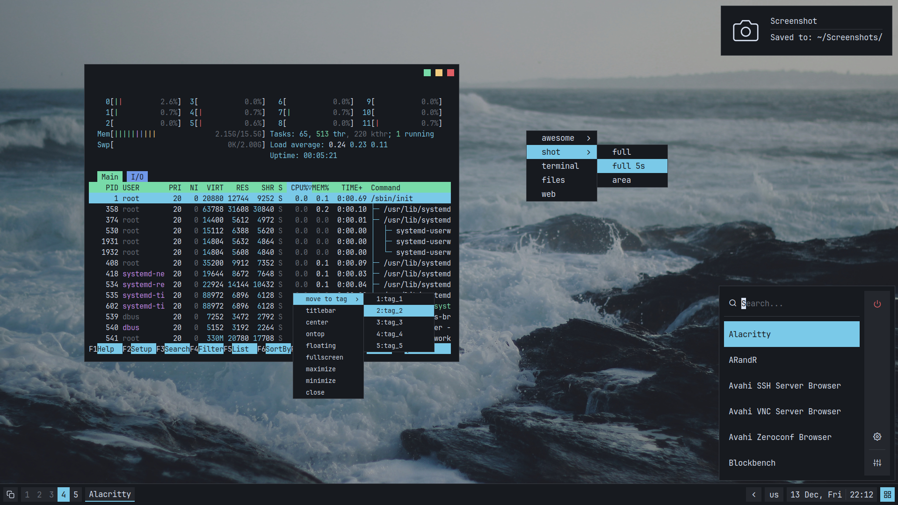
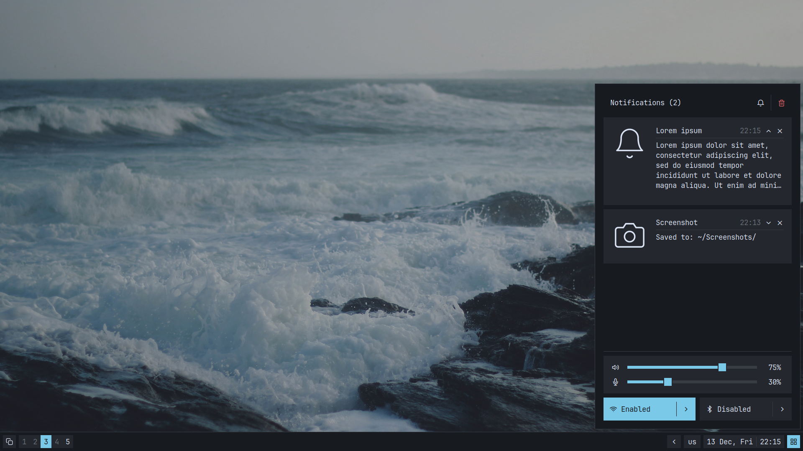

<p align="center">
    
    
</p>

</details>

## Instalation

#### Install dependencies:
1. necessary
```
$ sudo pacman -S xorg xorg-xinit pulseaudio pulseaudio-bluetooth \
networkmanager bluez bluez-utils luarocks picom maim lxappearance
```
2. optional (you also need terminal emulator, file manager etc.)
```
$ sudo pacman -S alacritty nemo nemo-fileroller leafpad eom 
```

#### Install lua modules

<div align="center">

| Module                                                            | Description                   |
| ----------------------------------------------------------------- | ----------------------------- |
| [luautf8](https://github.com/starwing/luautf8?tab=readme-ov-file) | Needed for text input widgets |


</div>

```
$ sudo luarocks install luautf8
```

#### Install `awesome-git` package from aur (`pikaur` for example)
```
$ pikaur -S awesome-git
```

#### Start & enable `network manager` & `bluez` services
```
$ systemctl start NetworkManager
$ systemctl enable NetworkManager
$ systemctl start bluetooth
$ systemctl enable bluetooth
```

#### Clone repo
```
$ git clone --depth 1 https://github.com/myagko/dotfiles.git
```

#### Copy contens of `dotfiles/home` to your home folder (i use `rsync` instead of copying every folder with `cp -r`)
```
$ rsync -avhu ~/dotfiles/home/ ~/
```

#### Edit `~/.config/awesome/user.lua` as you need, you can set wm theme, choose default apps, and set data for weather widget

#### Download [JetBrainsMonoSlashed](https://github.com/sharpjs/JetBrainsMonoSlashed/releases) font and put it to `~/.fonts`

<details>
<summary><b>Additional customisation</b></summary>

#### Icons and themes
1. Install `themix-full-git` from aur
2. Export icons and theme from user presets

#### Cursors (`inkscape` required) ([source](https://github.com/charakterziffer/cursor-toolbox))
```
$ cd ~/dotfiles/extra/cursor_toolbox
$ ~/dotfiles/extra/cursor_toolbox/render-pngs.py ~/dotfiles/extra/cursor_toolbox/sharp_dark.svg
$ ~/dotfiles/extra/cursor_toolbox/make_dark.sh
$ cp -r sharp_cursors_dark ~/.icons
```

#### Firefox css
1. Search `about:config`.
2. `toolkit.legacyUserProfileCustomizations.stylesheets`, `layers.acceleration.force-enabled`, `gfx.webrender.all`, `svg.context-properties.content.enabled` change to `True`.
3. Copy `~/dotfiles/extra/mozilla/chrome` to `~/.mozilla/firefox/XXXXXXX.default-release/`.

#### Firefox startpage
1. Edit `/usr/lib/firefox/autoconfig.cfg`
```
var {classes:Cc,interfaces:Ci,utils:Cu} = Components;
try {
  Cu.import("resource:///modules/AboutNewTab.jsm");
  var newTabURL = "file:///home/username/yourfile.html";
  AboutNewTab.newTabURL = newTabURL;
} catch(e){Cu.reportError(e);}
```
2. Edit `/usr/lib/firefox/defaults/pref/autoconfig.js`
```
pref("general.config.filename", "autoconfig.cfg");
pref("general.config.obscure_value", 0);
pref("general.config.sandbox_enabled", false);
```
3. Set homepage at firefox settings

#### Apply cursors, icons and gtk themes with `lxappearance`

</details>

## Keybinds

<div align="center">

| Keybinding            | Description                              |
| --------------------- | ---------------------------------------- |
| `Mod+Shift+r`         | Restart awesomewm                        |
| `Mod+Tab`             | Switch to next client by index           |
| `Mod+Shift+Tab`       | Switch to previus client by index        |
| `Mod+Ctrl+Tab`        | Restore minimized client                 |
| `Mod+Shift+s`         | Swap with next client by index           |
| `Mod+Ctrl+s`          | Swap with previous client by index       |
| `Mod+Shift+a`         | Increase the number of master clients    |
| `Mod+Ctrl+a`          | Decrease the number of master clients    |
| `Mod+Shift+q`         | Increase the number of columns           |
| `Mod+Ctrl+q`          | Decrease the number of columns           |
| `Mod+Shift+e`         | Increase master width factor             |
| `Mod+Ctrl+e`          | Decrease master width factor             |
| `Mod+Ctrl+Shift+e`    | Reset master width factor                |
| `Mod+Space`           | Switch layout                            |
| `Mod+1...9`           | Only view tag                            |
| `Mod+Shift+1...9`     | Move focused client to tag               |
| `Mod+z`               | Close client                             |
| `Mod+x`               | (Un)Maximize client                      |
| `Mod+c`               | Minimize client                          |
| `Mod+v`               | Toggle client fullscreen                 |
| `Mod+b`               | Toggle client ontop                      |
| `Mod+n`               | Move client to center                    |
| `Mod+m`               | Toggle client menu                       |
| `Mod+Ctrl+Return`     | Move client to master                    |
| `Mod+d`               | Open app launcher                        |
| `Mod+q`               | Open powermenu                           |
| `Mod+Return`          | Open terminal                            |
| `Mod+Print`           | Take screenshot                          |
| `Mod+Shift+Print`     | Take screenshot area                     |

</div>

---

#### Special thx to [Kasper24](https://github.com/Kasper24) for sharing their [KwesomeDE](https://github.com/Kasper24/KwesomeDE) configuration!
