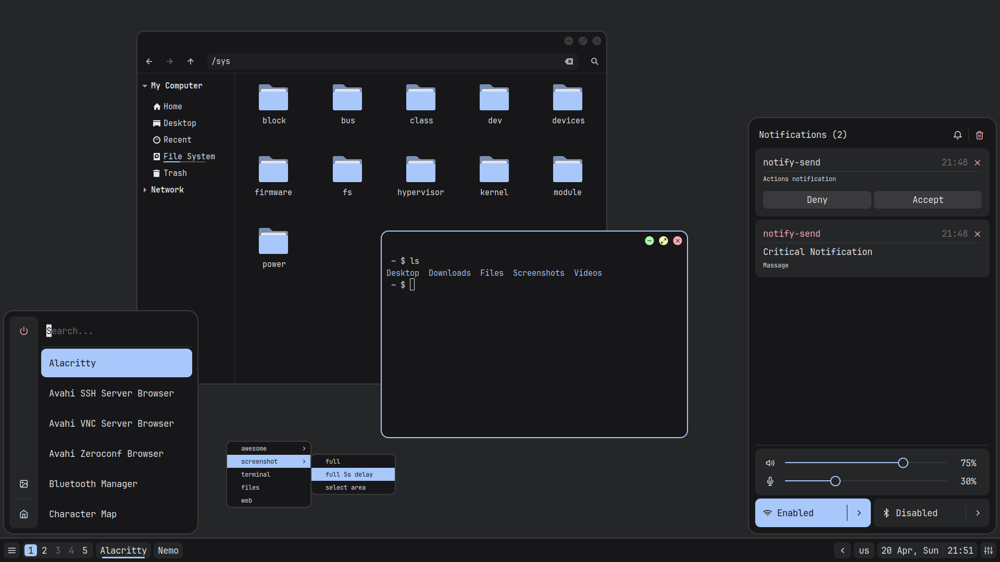

# AwesomeWM

<p align="center">
    
</p>

<details>
<summary><b>Installation</b></summary>

#### 1. Install dependencies
```
xorg
xorg-xinit
awesome-git (aur)
luarocks
pulseaudio
pulseaudio-bluetooth
networkmanager
bluez
bluez-utils
picom
maim
zenity
alacritty
nemo
leafpad
eom
mpv
```
for example using [pikaur](https://github.com/actionless/pikaur) as an aur helper
```
$ pikaur -S xorg xorg-xinit awesome-git luarocks pulseaudio pulseaudio-bluetooth networkmanager bluez bluez-utils picom maim zenity alacritty nemo leafpad eom mpv
```

#### 2. Install lua modules

<div align="center">

| Module                                                            | Description                   |
| ----------------------------------------------------------------- | ----------------------------- |
| [luautf8](https://github.com/starwing/luautf8?tab=readme-ov-file) | Needed for text input widgets |

</div>

```
$ sudo luarocks install luautf8
```

#### 3. Start & enable `network manager` & `bluez` services

#### 4. Clone repo
```
$ git clone --depth 1 https://github.com/btvtkh/dotfiles.git
```

#### 5. Copy contens of `dotfiles/home` to your `home` folder (use `rsync` for example)
```
$ rsync -avhu ~/dotfiles/home/ ~/
```

#### 6. Download [JetBrainsMonoSlashed](https://github.com/sharpjs/JetBrainsMonoSlashed/releases) font and put it to `~/.fonts`

#### 7. Set `alacritty` as a default terminal
```
$ gio mime x-scheme-handler/terminal Alacritty.desktop
```

</details>

<details>
<summary><b>Customisation</b></summary>

#### 8. Edit `~/.config/awesome/user.lua` as you need

#### 9. Install icons and themes
1. Install `themix-full-git` from aur
2. Export icons and theme from user presets

#### 10. Install cursors ([source](https://github.com/charakterziffer/cursor-toolbox))
```
$ cd ~/dotfiles/extra/cursor-toolbox
$ ./make_dark.sh
$ cp -r Sharp-Cursors ~/.icons
```

#### 11. Apply firefox css
1. Search `about:config`.
2. `toolkit.legacyUserProfileCustomizations.stylesheets`, `layers.acceleration.force-enabled`, `gfx.webrender.all`, `svg.context-properties.content.enabled` change to `True`.
3. Copy `~/dotfiles/extra/mozilla/chrome` to `~/.mozilla/firefox/XXXXXXX.default-release/`.

</details>

<details>
<summary><b>Keybinds</b></summary>

<div align="center">

| Keybinding            | Description                              |
| --------------------- | ---------------------------------------- |
| `Mod+Shift+r`         | Restart awesomewm                        |
| `Mod+Tab`             | Switch to next client by index           |
| `Mod+Shift+Tab`       | Switch to previus client by index        |
| `Mod+Ctrl+Tab`        | Restore minimized client                 |
| `Mod+Shift+s`         | Swap with next client by index           |
| `Mod+Ctrl+s`          | Swap with previous client by index       |
| `Mod+Shift+a`         | Increase the number of master clients    |
| `Mod+Ctrl+a`          | Decrease the number of master clients    |
| `Mod+Shift+q`         | Increase the number of columns           |
| `Mod+Ctrl+q`          | Decrease the number of columns           |
| `Mod+Shift+e`         | Increase master width factor             |
| `Mod+Ctrl+e`          | Decrease master width factor             |
| `Mod+Ctrl+Shift+e`    | Reset master width factor                |
| `Mod+Space`           | Switch layout                            |
| `Mod+1...9`           | Only view tag                            |
| `Mod+Shift+1...9`     | Move focused client to tag               |
| `Mod+z`               | Close client                             |
| `Mod+x`               | (Un)Maximize client                      |
| `Mod+c`               | Minimize client                          |
| `Mod+v`               | Toggle client fullscreen                 |
| `Mod+b`               | Toggle client ontop                      |
| `Mod+m`               | Toggle client menu                       |
| `Mod+Ctrl+Return`     | Move client to master                    |
| `Mod+d`               | Open app launcher                        |
| `Mod+q`               | Open powermenu                           |
| `Mod+w`               | Open control panel                       |
| `Mod+e`               | Open day info panel                      |
| `Mod+Return`          | Open terminal                            |
| `Mod+Print`           | Take screenshot                          |
| `Mod+Shift+Print`     | Take screenshot area                     |

</div>

</details>
